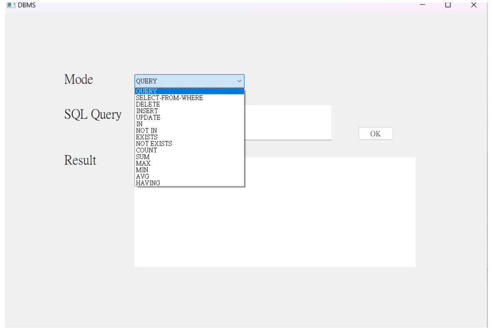

# Movie DBMS

## 系統環境架構

- 環境：Anaconda
- 語言：Python 3.8.10
- SQL：SQLite

## 使用說明

- 從Mode選單中選取模式

- QUERY模式：可在SQL Query輸入SQL指令查詢、修改資
料庫

- 其餘模式：會直接執行指令功能，ex:MAX

- Result 區域顯示結果

## ER Diagram

## Relation Schema

## Tables

### Movie

- 電影資料
- Attribute
    - ID
    - Name
    - Box office
    - Date
        - 上映日期
    - Genre
    - DirectorID
    - Distributed by
        - 發行商名稱

### Actor

- 演員資料
- Attribute
    - ID
    - Name
        - First name
        - Last name
    - Distributed by
        - 發行商名稱
    - Award(s) in 2022
        - 在2022得到與影視相關的獎項

### Studio

- 發行商資料
- Attribute
    - Name
    - Headquarter location
    - CEO
    - Revenue

### Director

- 導演資料
- Attribute
    - ID
    - Name
        - First name
        - Last name

### Theater

- 影城資料
- Attribute
    - ID
    - Name
    - Address

### ActorMovie

- 紀錄演員與出演的電影
- Attribute
    - ActorID
    - MovieID

### MovieTheater

- 紀錄那些影城上映哪些電影
- Attribute
    - MovieID
    - TheaterID

## Relationship

### Directed by

- 這部電影是被誰執導的

### Acting in

- 這位演員出演這部電影

### Played in

- 這部電影被哪個影城放映

### Published by

- 這部電影的發行商是哪家公司